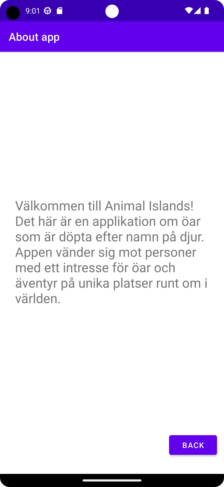

# Rapport  

I MainActivity skapades metoden "onPostExecute()" för att hantera json-data i metoden loopas json-datan
och plockar ut olika strängar vilket i sin tur läggs till i olika listor som har olika användningsområden.
Den första är för att visa upp en liten del av varje objektet i Recycler-vyn som finns på huvudaktivitet,
den andra till en spinner med alla värden på location och tredje är för en med mer data om objektet 
som visas upp i en detaljerad-vy i en annan aktivitet som visas när man klickar på en av raderna i Recycler-vyn
(se kodsegment 1). Man har dessutom skapat några ytterligare klasser för att hantera bland annat 
en "about"-aktivitet där information om appen presenteras, en "detailed"-aktivitet som hanterar och
skapar element i dennes layout, "Island"-klassen med metoder som omvandlar json datan till olika datatyper 
(se kodsegment 2). Exempelbilder på appen (se bilderna nedan).


# Kodsegment 1:
```
 public void onPostExecute(String json) {
        Gson gson = new Gson();
        Island[] islands = gson.fromJson(json, Island[].class);
        // Arraylists
        ArrayList<String> detailedItems = new ArrayList<>();
        ArrayList<RecyclerViewItem> items = new ArrayList<>();

        List<String> countryItems = new ArrayList<>();

        for (Island island : islands) {
            items.add(new RecyclerViewItem(island.toString()));
            detailedItems.add(island.getInfo());
            countryItems.add(island.getLocation());
        }

        ArrayAdapter<String> dropAdapter = new ArrayAdapter<>(this,android.R.layout.simple_spinner_dropdown_item, countryItems);
        dropdownMenu.setAdapter(dropAdapter);

        RecyclerViewAdapter adapter = new RecyclerViewAdapter(this, items, detailedItems, item -> {
            Intent intent = new Intent(MainActivity.this, DetailedActivity.class);
            intent.putExtra("itemString", item);
            startActivity(intent);
        });
```
# Kodsegment 2:
```
public class DetailedActivity extends AppCompatActivity {

    @Override
    protected void onCreate(Bundle savedInstanceState) {
        super.onCreate(savedInstanceState);
        setContentView(R.layout.detailedview_item);

        Button backButton = findViewById(R.id.back_button2);

        String itemString = getIntent().getStringExtra("itemString");

        TextView textView = findViewById(R.id.info); // TextView i din layout
        textView.setText(itemString);
        backButton.setOnClickListener(new View.OnClickListener() {
            @Override
            public void onClick(View v) {
                finish();
            }
        });
    }
}

public class AboutActivity extends AppCompatActivity {

    @Override
    protected void onCreate(Bundle savedInstanceState) {
        super.onCreate(savedInstanceState);
        setContentView(R.layout.activity_about);

        String aboutTitle = getIntent().getStringExtra("title");

        if(aboutTitle != null) {
            setTitle(aboutTitle);
        }
        Button backButton = findViewById(R.id.back_button);

        backButton.setOnClickListener(new View.OnClickListener() {
            @Override
            public void onClick(View v) {
                finish();
            }
        });
    }
}
```


